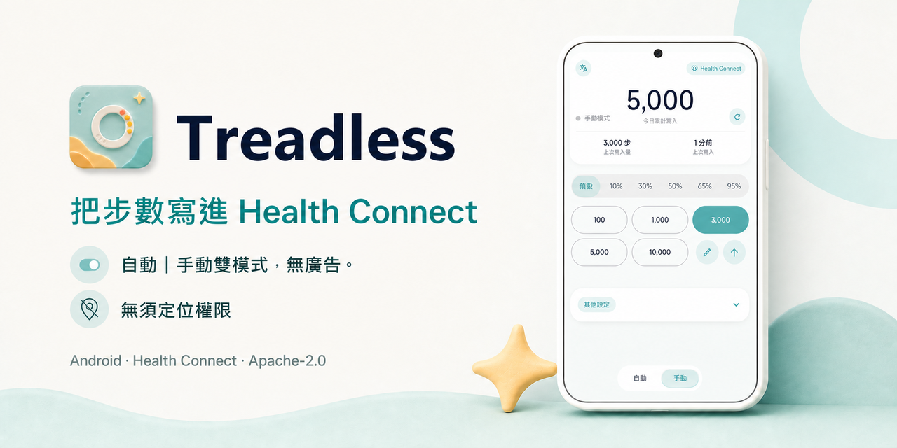

# Treadless

[繁體中文](README.md) · **English**

Writes a chosen number of steps into Android **Health Connect**, either on a
schedule or with a single tap.

**It requests no location permissions of any kind** and has nothing to do with
GPS spoofing.

| Onboarding | Auto mode |
|---|---|
|  |  |

---

## What it doesn't do

**No GPS spoofing.** The app holds no location permissions and never touches mock
location. It writes `StepsRecord` and `DistanceRecord`, and nothing else.

**No reading, either.** It asks for write access only, so it cannot see your
health data.

## ⚠️ Read this first

What it writes are **real health records**. Every other app that reads Health
Connect — fitness, insurance, games — can see them, and **Treadless cannot delete
what it wrote**. Removing them means going into Health Connect's own data
management screen.

Point this at a service that rewards step counts and you **may be breaking that
service's terms of use**. The more implausible your numbers, the more obvious it
is, and if the account gets actioned that's on you.

---

## Features

Two ways to write. **Auto mode** takes a rate and an interval, then a foreground
service writes on schedule; the ongoing notification shows the running total and
a countdown, with a stop button on it. **Manual mode** lays your usual amounts out
as buttons, one tap each.

The rest:

- Those buttons come in groups, up to 6 groups of 5 values, with names and order
  you set yourself
- A confirmation step before each write, on by default, and switchable off
- Optionally opens an app of your choice 0.5–3.0 s after a successful write
- Today's total rolls over at midnight without an alarm, so it holds even if the
  app never opened
- Writes distance alongside steps if you want, converted from your stride length
  (0.30–1.50 m)
- A five-page walkthrough on first run; the permission pages animate what you
  need to tap
- English and Traditional Chinese, switchable inside the app, foreground-service
  notification included

## Requirements

| | |
|---|---|
| Android | 8.0 (API 26) or newer |
| [Health Connect](https://play.google.com/store/apps/details?id=com.google.android.apps.healthdata) | Required (built into Android 14 and newer) |
| Refraction and lens effects on the glass UI | Android 13 (API 33) or newer; older versions fall back to plain translucent glass |

## Download and install

1. Grab `app-release.apk` from [Releases](../../releases).
2. Allow your browser or file manager to install unknown apps.
3. Open it and follow the walkthrough to grant Health Connect **Steps** and
   **Distance** write access.

Later versions install straight over the top; your settings and data are kept.

---

## How to use

### First run

The first page lets you pick the interface language, and it applies right away.
The next three cover Health Connect write access, notification permission, and
setting battery usage to Unrestricted. The permission pages animate what you need
to tap; go do it in system settings, come back, and the app notices on its own.

You can skip all three with "Maybe later". The "Finish setup" card on the main
screen keeps reminding you, and tapping an item jumps to the right settings page.

### Auto mode

1. **Steps per minute**: how many steps each minute of writing is worth. A
   typical walking pace is about 100, brisk walking about 130.
2. **Write interval**: how often to write (10–3600 s). This doesn't change the
   total, only how many batches it arrives in.
3. **Also write distance**: writes a `DistanceRecord` alongside. The gear icon
   sets your stride length.
4. Press **Start auto-writing**. The status row counts down to the next write,
   and the ongoing notification mirrors it with a stop button.

For long sessions, set battery usage to Unrestricted, or Android may interrupt
background writes.

### Manual mode

The group switcher sits on top, that group's values below it.

Tap any value to write it (a confirmation appears first, by default). **✎** opens
the editor: rename the group (up to 4 half-width characters, so 2 CJK or 4
alphanumeric), change values, reorder groups, delete one. Blank value fields are
ignored. **↑↓** flips between low-to-high and high-to-low. **＋** adds a group, up
to 6.

Writes are capped at one per second, so leave a beat between taps.

### Settings

| | |
|---|---|
| Confirm before writing | Shows the step count and asks for confirmation. On by default. |
| Open app after writing | Opens a chosen app after a successful write, following the delay you set. |
| Language | The 文A button, top left of the main screen. The app restarts itself to apply. |
| Reset today's total | The ↻ beside the big number. It only clears this app's counter, and **does not delete anything already written to Health Connect**. |

### Deleting what it wrote

Treadless has no delete function and no read access. Open Health Connect →
Data and access → Activity → Steps → Delete.

---

## Known limitations

Default group names are stored in your data and don't follow the interface
language, so switching to English leaves the original names sitting there until
you rename them.

With the screen off and unplugged, Doze can delay background writes. Set battery
usage to Unrestricted for long sessions.

## Reporting a problem

Open an [issue](../../issues) with your Android version, device model, and either
a screenshot or the steps that led to it.

---

## License

Apache License 2.0, see [LICENSE](LICENSE).

Copyright 2026 Kizaki Works

## Building from source

Toolchain, Gradle tasks, signing setup and module layout are in
[docs/BUILDING.md](docs/BUILDING.md).
