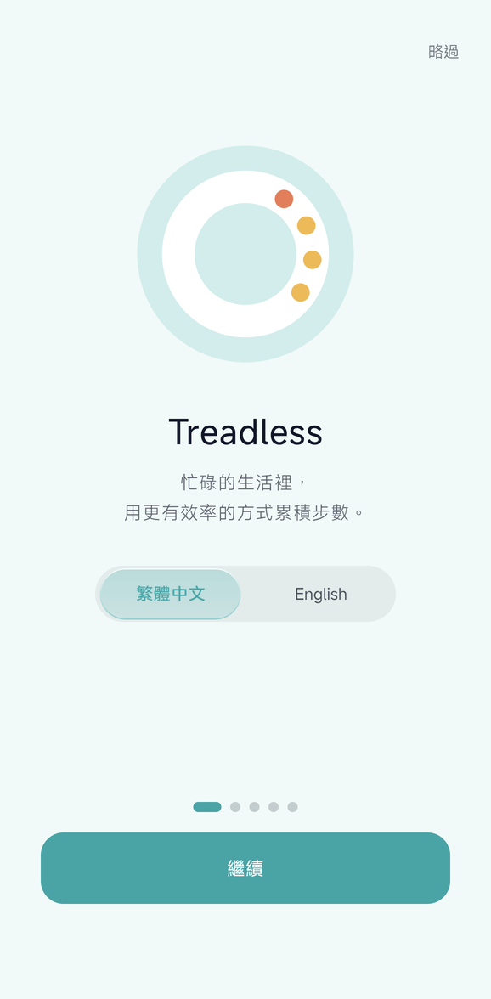
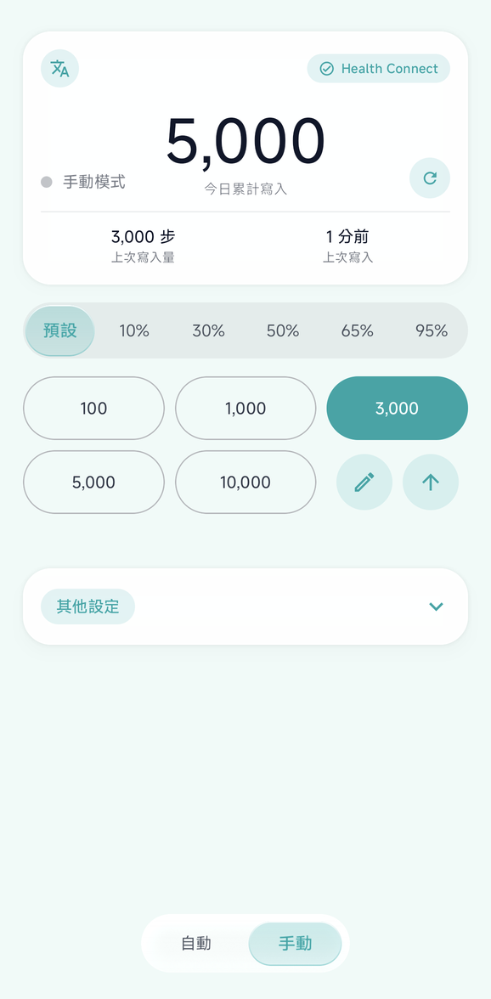

# Treadless

**繁體中文** · [English](README.en.md)

把設定好的步數，定時或按一下寫進 Android 的 **Health Connect**。

**完全沒有任何定位權限**，和模擬 GPS 無關。

| 首次啟動導覽 | 手動模式 |
|---|---|
|  |  |

---

## 它不做什麼

**不是模擬 GPS。** 這支 App 沒有任何定位權限，也不碰 mock location。它只寫
Health Connect 的 `StepsRecord` 與 `DistanceRecord`，沒有別的。

**也不讀你的資料。** 只申請了寫入權限，沒有讀取權限。

## ⚠️ 使用前請讀

寫進去的是**真實的健康記錄**。其他讀 Health Connect 的 App（健身、保險、遊戲）
都看得到，而且**這支 App 刪不掉自己寫過的東西**，要刪只能去 Health Connect
的資料管理頁。

拿它去餵那些用步數換獎勵的服務，**可能違反對方的使用條款**。數值開得越誇張越明顯，
帳號被處置的後果你得自己扛。

---

## 功能

兩種寫法。**自動模式**設好每分鐘步數與間隔，前景服務就按時寫，常駐通知顯示累計與
下次寫入倒數，可以直接從通知停掉。**手動模式**把常用的數值排成快捷鍵，按一下寫一次。

其餘：

- 快捷鍵是分組的，最多 6 組、每組 5 個值，短名和順序都可以自己排
- 寫入前會先跳確認，預設開啟，可以關掉
- 可以設定寫完之後隔 0.5–3.0 秒自動開啟指定的 App
- 今日累計午夜自動歸零，不靠鬧鐘，App 沒開也不會漏掉換日
- 可以順便寫距離，用步長（0.30–1.50 m）換算
- 首次啟動有五頁導覽，權限那幾頁會動給你看該點哪裡
- 繁體中文與 English 在 App 內即時切換，連前景服務的通知一起換

## 需求

| 項目 | 版本 |
|---|---|
| Android | 8.0（API 26）以上 |
| [Health Connect](https://play.google.com/store/apps/details?id=com.google.android.apps.healthdata) | 需安裝（Android 14 以上為系統內建） |
| 玻璃介面的折射與透鏡效果 | Android 13（API 33）以上；以下版本自動降級為半透明玻璃 |

## 下載與安裝

1. 從 [Releases](../../releases) 下載 `app-release.apk`。
2. 允許你的瀏覽器或檔案管理員「安裝未知來源的應用程式」。
3. 安裝後開啟，照導覽把 Health Connect 的**步數**與**距離**寫入權限打開。

後續版本直接覆蓋安裝就好，設定與資料都會保留。

---

## 使用說明

### 首次啟動

第一頁就能選介面語言，選了立刻套用。後面三頁分別是 Health Connect 寫入權限、
通知權限、以及把電池用量設為「不受限制」。權限那兩頁會動給你看該點哪裡，
你去系統設定好再回來，它自己會偵測到。

三項都可以按「稍後再說」跳過。主畫面的「尚待設定」卡片會繼續提醒，點一下就跳到
對應的設定頁。

### 自動模式

1. **每分鐘步數**：一分鐘寫入幾步。一般走路約 100、快走約 130。
2. **寫入間隔**：多久寫一次（10–3600 秒）。間隔不影響總量，只影響分幾次寫。
3. **同步寫入距離**：開啟後同時寫 `DistanceRecord`，齒輪可調步長。
4. 按 **開始自動寫入**。狀態列顯示下次寫入倒數，常駐通知同步顯示並提供停止鈕。

長時間掛機記得把電池用量設為「不受限制」，否則系統可能中斷背景寫入。

### 手動模式

上方是分組切換鍵，下方是該組的快捷數值。

點任一數值就寫入（預設會先跳確認）。**✎** 開編輯：改組名（限 4 個半形位，
2 個中文字或 4 個英數）、改數值、調整分組順序、刪除分組，空白的數值欄位會被忽略。
**↑↓** 切換數值由小到大或由大到小。**＋** 新增分組，最多 6 組。

寫入頻率上限是每秒一次，連點請間隔一秒。

### 設定

| 項目 | 說明 |
|---|---|
| 寫入前確認 | 顯示即將寫入的步數並要求確認。預設開啟。 |
| 寫完自動開啟 App | 寫入成功後延遲指定秒數開啟指定 App。 |
| 語言 | 主畫面左上角的「文A」鍵。切換後 App 會重建以套用。 |
| 今日累計重置 | 主畫面數字右側的 ↻。只影響本 App 的計數，**不會刪除已寫入 Health Connect 的資料**。 |

### 要刪掉寫進去的資料？

這支 App 沒有刪除功能，也沒有讀取權限。請開啟 Health Connect →
資料和存取權 → 活動 → 步數 → 刪除。

---

## 已知限制

分組的預設名稱存在使用者資料裡，不會隨介面語言切換，所以切成英文之後仍然是原本的
名字，得自己改。

螢幕關閉又沒接電源時，系統的 Doze 可能延後背景寫入；長時間掛機請設定電池用量為
「不受限制」。

## 回報問題

請開 [Issue](../../issues)，附上 Android 版本、機型，以及發生問題時的畫面或步驟。

---

## 授權

Apache License 2.0，見 [LICENSE](LICENSE)。

Copyright 2026 Kizaki Works

## 從原始碼建置

建置環境、Gradle 指令、簽章設定與模組結構見 [docs/BUILDING.md](docs/BUILDING.md)。
