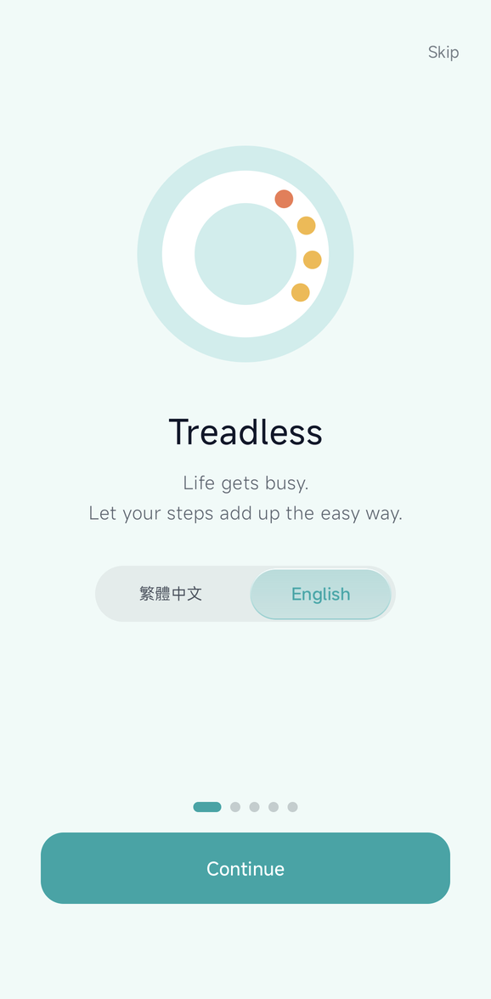
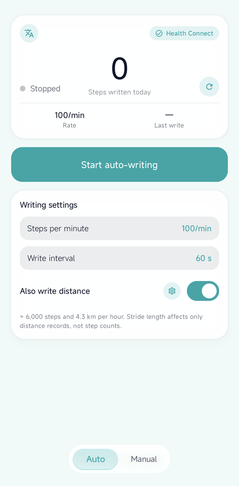

# Treadless

**English** · [繁體中文](README.zh-TW.md)

Writes a chosen number of steps into Android **Health Connect** — on a schedule,
or with a single tap.

**It requests no location permissions of any kind** and has nothing to do with
GPS spoofing.

| Onboarding | Auto mode |
|---|---|
|  |  |

---

## What it is, and what it isn't

**It is** a record generator that writes steps — and optionally distance — into
Health Connect. You set how many steps per minute and how often to write, and it
does that; or you tap a preset amount in Manual mode.

**It isn't**:

- **Not GPS spoofing.** The app holds no location permissions and never touches
  mock location. It writes `StepsRecord` and `DistanceRecord`, nothing else.
- **Not a reader.** It requests write access only. It cannot see your health data.

## ⚠️ Read this first

What it writes are **real health records**. Every other app that reads Health
Connect — fitness, insurance, games — will see them, and **Treadless cannot
delete them**. Removing them means going into Health Connect's own data
management screen.

Using this to feed any service that rewards step counts **may violate that
service's terms of use**. The consequences, account action included, are yours to
carry, and the more implausible your numbers the greater the risk. This tool
makes no guarantees on that front.

---

## Features

- **Auto mode** — set steps per minute and a write interval; a foreground service
  writes on schedule. The ongoing notification shows the session total and a
  countdown to the next write, with a stop button.
- **Manual mode** — quick-step presets in **groups**: up to 6 groups (short
  custom names, reorderable), each holding up to 5 values (deduplicated and
  sorted on save; display order can be flipped). One tap writes.
- **Confirm before writing** — on by default. These are real health records;
  a stray tap costs more than an extra one.
- **Open an app after writing** — optional, 0.5–3.0 s delay, with a built-in app
  picker that shows icons.
- **Today's total** — how much you have written today. Rolls over at midnight on
  its own (by date comparison, no alarms, so it holds even if the app never
  opened) and can be reset by hand.
- **Write distance too** — optional. Converts steps using your stride length
  (0.30–1.50 m) into a `DistanceRecord`.
- **First-run walkthrough** — five pages: welcome (with language choice), the two
  modes, Health Connect access, notifications, battery. The permission pages
  animate what you need to do and poll to detect when it's done.
- **Bilingual** — English and Traditional Chinese, switchable inside the app
  (independent of your system language). The foreground-service notification
  follows along.

## Requirements

| | |
|---|---|
| Android | 8.0 (API 26) or newer |
| [Health Connect](https://play.google.com/store/apps/details?id=com.google.android.apps.healthdata) | Required (built into Android 14 and newer) |
| Refraction and lens effects on the glass UI | Android 13 (API 33) or newer; older versions fall back to plain translucent glass |

## Download and install

1. Grab `app-release.apk` from [Releases](../../releases).
2. Allow your browser or file manager to install unknown apps.
3. Open it and follow the walkthrough to grant Health Connect **Steps** and
   **Distance** write access.

> **Updating**: later versions install straight over the top; your settings and
> data are kept.

---

## How to use

### First run

The first page of the walkthrough lets you pick the interface language (English
or Traditional Chinese); it applies immediately. The next three pages walk you
through Health Connect write access, notification permission, and setting battery
usage to Unrestricted.

You can skip all three with "Maybe later" — the "Finish setup" card on the main
screen keeps reminding you, and tapping an item jumps to the right settings page.

### Auto mode

1. **Steps per minute** — how many steps a minute of writing represents. A
   typical walking pace is about 100; brisk walking about 130.
2. **Write interval** — how often to write (10–3600 s). The interval doesn't
   change the total, only how many batches it arrives in.
3. **Also write distance** — writes a `DistanceRecord` alongside. The gear icon
   sets your stride length.
4. Press **Start auto-writing**. The status row counts down to the next write,
   and the ongoing notification mirrors it with a stop button.

> For long sessions, set battery usage to Unrestricted — otherwise Android may
> interrupt background writes.

### Manual mode

The group switcher sits on top; that group's preset values sit below it.

- Tap any value → (a confirmation appears by default) → it writes to Health Connect.
- **✎ Edit** — rename the group (up to 4 half-width characters: 2 CJK or 4
  alphanumeric), change values, reorder groups, delete a group. Blank value
  fields are ignored.
- **↑↓** — flip between low-to-high and high-to-low display order.
- **＋** — add a group (6 maximum).

Writes are capped at one per second, so leave a beat between taps.

### Settings

| | |
|---|---|
| Confirm before writing | Shows the step count and asks for confirmation. On by default. |
| Open app after writing | Opens a chosen app after a successful write, following the delay you set. |
| Language | The 文A button, top left of the main screen. The app restarts itself to apply. |
| Reset today's total | The ↻ beside the big number. It only clears this app's counter — **it does not delete anything already written to Health Connect**. |

### Deleting what it wrote

Treadless has no delete function (and no read access). Open Health Connect →
Data and access → Activity → Steps → Delete.

---

## Known limitations

- Default group names are stored in your data and **do not follow the interface
  language**, so switching to English leaves the original names in place until
  you rename them yourself.
- With the screen off and unplugged, Doze can delay background writes. Set
  battery usage to Unrestricted for long sessions.
- The app cannot delete records it has written.

## Reporting a problem

Open an [issue](../../issues) with your Android version, device model, and either
a screenshot or the steps that led to it.

---

## License

Apache License 2.0 — see [LICENSE](LICENSE).

Copyright 2026 Kizaki Works

## Building from source

Toolchain, Gradle tasks, signing setup and module layout are in
[docs/BUILDING.md](docs/BUILDING.md).
